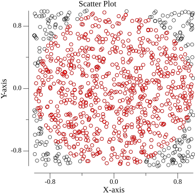

Monte Carlo Pi Simulator
========================

Overview
--------

This Golang program is a command-line interface (CLI) application that performs a Monte Carlo simulation to estimate the value of π. The simulation generates random points within a square and determines how many fall within a quarter circle inscribed in the square. By using the ratio of points within the circle to the total number of points, the program approximates the value of π.

The main steps of the Monte Carlo Pi Simulation are:

1. **Generate random points**: Generates a specified number of random points within a unit square.
2. **Determine inclusion**: Determine which points fall inside the unit circle by checking if they satisfy the equation x2+y2≤1x2+y2≤1.
3. **Estimate π**: Use the ratio of points within the quarter circle to the total number of points to approximate the value of π.

The program provides both the estimated value of π and a visual representation of the generated points in a scatter plot. The scatter plot is saved as an image file for further analysis or visualization.

The application is designed as a CLI tool, allowing users to run simulations and visualise results in a terminal environment.

Program Overview
----------------

### 1\. Golang Concurrency

* The Monte Carlo simulation utilises Golang's concurrency features to efficiently generate and process a large number of random points concurrently.
* Goroutines are employed to handle the parallel generation of random points, improving the overall performance of the simulation.
* Utilises Golang's random number generation and math libraries for a robust Monte Carlo simulation.
* Leverages Golang's plotting library (gonum/plot) for data visualisation.

### 2\. Modular Structure

* Organized in a modular structure to enhance code readability and maintainability.
* The `monteCarloPiSimulation` function encapsulates the core logic of the Monte Carlo simulation.
* The `visualisePoints` function abstracts the details of creating a scatter plot for easy visualization.

### 3\. Plotting with Gonum/Plot

* Golang's  plotting library, Gonum/Plot, is utilised to create a visual representation of the generated points.
* The `visualisePoints` function uses Gonum/Plot's Scatter plot to visualise the random points, aiding in the analysis of the Monte Carlo simulation results. This Scatter plot is saved as a png image to the local project directory. 

### 4\. Customization

* The program provides configuration options within the `main` function, allowing users to experiment with different simulation parameters.
* Users can easily adjust the number of random points and observe the impact on the accuracy of the π estimation.


Usage
-----

To run the Monte Carlo Pi Simulator, execute the following command:

bash

`go run .`

The simulation will print the estimated value of π based on the specified number of random points.

Installation
------------

Make sure you have Go installed on your machine. You can install the necessary dependencies by running:

bash

`go get -u gonum.org/v1/plot/...`

Configuration
-------------

You can configure the simulation by adjusting parameters in the `main` function, such as the number of random points (`numPoints`). Experiment with different values to observe how the accuracy of the estimation improves with more points.

Results
-------

The simulation will output the estimated value of π based on the generated random points. You can analyse how the estimation converges to the actual value as the number of points increases.

**Example Output:**

```\
Estimated value of π using 1000 points: 3.132000
Saving Visualization to: montecarlo_scatter_plot.png
Visualization saved as montecarlo_scatter_plot.png
```

Visualisation
-------------

**Example Image**



The scatter plot visualizes the generated random points, with points inside the unit circle shown in a distinct color. The visualisation is saved as `montecarlo_scatter_plot.png` in the project directory.

Further Information
------------

 Need more information on the theory behind the Monte Carlo Pi simulation? Here is a visual representation I made, along with more information explained in plain English, where you can get a better understanding of the concept through interaction in your web browser.\
 <br/>\
 Check it out: [Monte Carlo Pi Simulation](https://monte-carlo-simulator-demo.netlify.app/)\
 <br>\
 Or click here for the [Git Repo](https://github.com/amy324/Visual-Monte-Carlo-Simulator.git)

About the Author
----------------

The author of this Monte Carlo Pi Simulator holds a master's degree in statistics, bringing a strong background of advanced statistical theory to her programming work. She has a passion for all things math related and the goal of this project is to showcase how statistical techniques and a solid understanding of mathematical theory can be leveraged in programming to solve interesting problems, even in small-scale applications such as this. This is a simplified version of a Monte Carlo simulation for ease of understanding.

Contributing
------------

Feel free to contribute to the project by opening issues, providing feedback, or submitting pull requests. Your input is valuable!

License
-------

This project is licensed under the MIT License.
